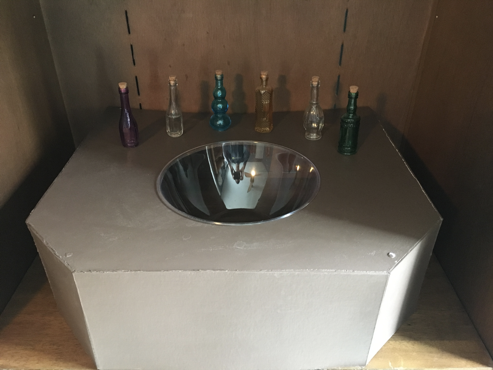

# pensieve

This project is a real-life recreation of the [Pensieve from Harry Potter](https://www.wizardingworld.com/writing-by-jk-rowling/pensieve). Using a Raspberry Pi, water level sensors, and other components, the final product plays a custom video beneath glowing water when a vile of water is poured into the basin.

Check out the blog post on the project [here](https://medium.com/@smrubin/an-engineers-marriage-proposal-using-a-raspberry-pi-to-create-the-pensieve-from-harry-potter-7f846926c31)

Demo of the Pensieve in Action

## Materials

To recreate the Pensieve as outlined in this repo, you'll need the following:
* Raspberry Pi 3 B+ (I used the [physical computing kit](https://www.microcenter.com/product/506707/element-14-raspberry-pi-3-model-b-physical-computing-kit), which has a lot of other needed components)
* Breadboard
* Jumper wires (male-to-male and male-to-female)
* GPIO breakout board
* [Analog to digital converter](https://learn.adafruit.com/raspberry-pi-analog-to-digital-converters/mcp3008)
* [Water level sensors](https://www.amazon.com/WINGONEER-Sensor-Droplet-Detection-Arduino/dp/B06XHDZ3Q4)
* Plastic bowls / containers
* Plastic tubing (~1 foot)

## Water Level Detection with the Raspberry Pi

The core of this project's setup revolves around the Raspberry Pi being able to detect a water level change digitally so that it can trigger the playing of a video.

I used an adhesive strip to attach the water level sensor to the inside of one of the plastic containers, with the sensor flush against the bottom. I then connected the Raspberry Pi, GPIO breakout board, breadboard, analog-to-digital converter, and water level sensor as shown in the schemasitc below. Also checkout the [fritzing file](./fritzing/pensieve.fzz).

I also added the python script to the Raspberry Pi and had it running in the background. When water is detected by the sensor, the script can perfrom an action, in this case the playing of a video I also added to the Pi.

## Pictures of Development and Final Product

Sketch of Pensieve Mechanics

Water Detection with the Raspberry Pi

Pensieve Basin Resting on Mount

Pensieve Mounted and Ready for Action

